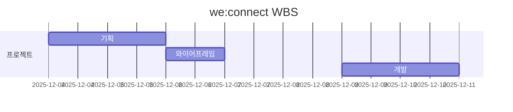

# we:connect

우리의 연결을 더 **강하게**

배포 링크: https://connect.110archive.com

## 1. 프로젝트 개요

### 1.1 프로젝트 소개

we:connect는 기업 내 팀원 간의 소통과 협업을 지원하는 통합 플랫폼입니다. 현대의 업무 환경에서는 원격 근무와 유연 근무제가 보편화되면서 팀원 간의 연결과 효율적인 업무 관리가 더욱 중요해지고 있습니다.

특히 재택 근무나 유연근무제를 도입한 회사에서는 팀원 간의 소통이 약화되고, 업무 진행 상황 파악이 어려워지는 문제가 발생할 수 있습니다.

we:connect는 약한 연결로 이루어진 팀원 간의 소통을 강화하고, 업무 효율성을 높이기 위한 다양한 기능을 제공합니다. weak connect에서 we:connect로, 우리의 연결을 더 강하게 만들어 갑니다.

### 1.2 주요 기능

#### 출퇴근 기록

재택 근무, 유연 근무제를 지원하는 출퇴근 기록 기능을 제공합니다. 사용자는 간편하게 출근 및 퇴근 시간을 기록하고, 근무 장소를 선택할 수 있습니다. 또한, 출퇴근 기록은 팀원들과 공유되어 실시간으로 확인할 수 있습니다.

#### 업무 일지

개인별 업무 일지 작성 및 관리 기능을 제공합니다. 사용자는 매일의 업무 내용을 기록하고, 이를 프로젝트와 연결하여 각 프로젝트별 참여 인원 및 진행 상황을 트래킹할 수 있습니다.

#### 프로젝트 관리

프로젝트 별로 팀원들을 관리하고, 프로젝트에 사용하는 Notion, Discord 등의 외부 도구와 연동하여 업무 효율성을 극대화합니다. 프로젝트 참여 상황, 진행 상황 등을 한눈에 파악할 수 있습니다.

#### 팀 현황

팀원들의 출퇴근 현황과 프로젝트 진행 상황을 실시간으로 확인할 수 있는 대시보드를 제공합니다. 이를 통해 팀 리더는 팀원들의 업무 상태를 효과적으로 관리할 수 있습니다.

팀원들의 출퇴근 현황을 확인해야 하는 모임 주최 기능도 포함하여 진행 사항을 빠르게 확인할 수 있습니다.

#### 예약 시스템

방송실과 강의실의 예약 시스템을 통해 팀원들이 필요한 공간을 효율적으로 사용할 수 있도록 지원합니다. 예약 현황을 확인하고, 간편하게 예약 관리를 할 수 있습니다.

## 2. 개발 환경 및 배포 URL

### 2.1 Frontend

| 기술                 | 버전   | 용도                         |
| -------------------- | ------ | ---------------------------- |
| **React**            | 19.2.0 | UI 라이브러리                |
| **Vite**             | 7.2.4  | 빌드 도구                    |
| **TailwindCSS**      | 4.1.17 | 유틸리티 기반 CSS 프레임워크 |
| **React Router DOM** | 7.10.1 | 클라이언트 사이드 라우팅     |
| **MSW**              | 0.47.4 | API 모킹 및 테스트           |

### 2.2 개발 도구

- **ESLint** - 코드 품질 관리
- **PostCSS** - CSS 전처리
- **Autoprefixer** - CSS 벤더 프리픽스 자동화

### 2.3 프로젝트 구조

```
src/
├── components/       # 공통 UI 컴포넌트
│   ├── layout/       # 레이아웃 (Header, Sidebar 등)
│   └── ui/           # 버튼, 인풋 등 기본 UI
├── features/         # 기능별 모듈
│   ├── attendance/   # 근무 기록
│   ├── tasks/        # 업무 일지
│   ├── projects/     # 프로젝트
│   ├── team/         # 팀 현황
│   ├── reservation/  # 예약
│   ├── profile/      # 프로필
│   └── auth/         # 인증
├── stores/           # 상태 관리 (Context API)
├── mock/             # Mock 데이터
├── hooks/            # 커스텀 훅
├── common/           # 공통 유틸리티
└── styles/           # 스타일 설정
```

## 3. WBS

- 개인 해커톤 프로젝트



## 4. 시연

[we:connect](https://connect.110archive.com)

## 5. 개발 프로세스

### 5.1 기획

Claude를 사용하여 문제 상황, 개발하고자 하는 기능, 요구사항 등을 분석하고 정리했습니다. 이를 바탕으로 기능 목록과 우선순위를 도출하여 개발 로드맵을 작성했습니다.

```plaintext
한국 중소기업(10인 이상)을 위한 생산성 플랫폼을 기획하려고 해.
현재 우리 회사는 Notion(문서), Discord(소통), Flex(근태)를 따로 쓰고 있어서 "누가 언제 무엇을 했는지" 파악하기 어려워.

다음 기능을 통해 이러한 생산성 문제를 개선하려고 해. 다음 기능을 포함한 통합 서비스를 기획해줘.

1. 재택을 하며 근무 시간을 기록해야 함. 근무 장소와 시간을 손쉽게 기록하고 디스코드에 메시지를 전달
2. 업무 일지를 개인별로 관리하며, 프로젝트와 연결하여 각 프로젝트별 참여 인원 및 진행 상황 트래킹
3. 프로젝트 히스토리 관리

```

사용자의 시나리오를 정의하여 각 기능의 요구사항을 구체화했습니다.

```plaintext

사용자: 김대리 (중소기업 마케팅팀)
시나리오:

1. 출근 일정 등록 → 알림 시 자동 출근 + Discord 알림
2. 업무 일지 작성 → 태스크 단위로 관리
3. 태스크를 프로젝트에 연결 → 게시글 형식 상세 작성
4. 프로젝트 히스토리에 자동 반영
5. 팀원 출퇴근 현황 및 프로젝트 진행 상황 파악

```

와이어프레임을 작성하여 화면 흐름과 UI 구성을 시각화했습니다.

```plaintext

React로 인터랙티브 와이어프레임을 만들어줘.
페이지: 대시보드, 근무 기록, 업무 일지, 프로젝트, 팀 현황

```

최종적으로 개발하고자 하는 기능을 명확히 하기 위해 MVP 요구사항 정의를 완료했습니다.

```plaintext

다음 내용을 포함하여 mvp 기획 문서를 작성해줘.

- 서비스 개요, 문제 정의, 솔루션
- 사용자 시나리오, MVP 기능
- 화면별 기능 정의
- 데이터 구조 (ERD)
- 기술 스택
- 개발 일정

```

### 5.2 개발

기획 단계의 산출물을 사용하여 Claude Code의 commands를 활용해 프론트엔드 개발을 진행했습니다. 주요 기능과 UI 컴포넌트를 단계별로 구현했으며, 각 기능에 대한 프롬프트 예시는 다음과 같습니다.

1. [기본 프로젝트 세팅](./.claude/commands/setup.md)
2. [디자인 시스템 정의](./.claude/commands/design-system.md)
3. [각 페이지별 레이아웃 및 기능 구현](./.claude/commands/wireframe.md)
4. [기능 수정 및 개선](./.claude/commands/refactor.md)

   - .claude/requirements에 `수정요청사항-1.md`, `수정요청사항-2.md` 등으로 파일을 작성하여 관리

   ```md
       # 수정 요청 사항 파일 실행

   argument로 들어오는 숫자를 확인하고, 다음 경로의 문서를 확인하고 개발을 진행합니다.

   - 경로: `.claude/requirements/수정요청사항-{argument}.md`
   - 예시: /refactor 1 -> `.claude/requirements/수정요청사항-1.md`
   ```

   ```bash
   /refactor 1
   ```

5. [커밋 메시지 작성](./.claude/commands/commit.md)
   - `~/.claude/commands/`에 작성하여 전체 프롬프트를 관리합니다.

## 6. 느낀점

### 6.1 바이브 코딩 사용 프로세스

claude code의 요구사항 문서를 작성하고 요청하는 과정을 통해 개발 프로세스를 체계화할 수 있었습니다.
특히 이전에는 CLI를 사용했기 때문에 요구사항이 로깅되지 않았고, 수정 요청 사항을 체계적으로 관리하기 어려웠습니다. 다음과 같은 프로세스를 통해서 요구사항을 명확히 파악할 수 있었고, 작업 속도도 향상시킬 수 있었습니다.

```
1. claude --dangerously-skip-permissions 실행
2. /refactor {number} 명령어로 수정 요청 사항 파일 지정
3. 실행되는 동안에 `수정요청사항.md` 파일 작성
```

### 6.2 기획의 중요성과 명확한 프롬프트 작성의 필요성

기획을 통해 요구사항 명세를 정확히 정의하는 것이 얼마나 중요한지 다시 한 번 깨달았습니다. 명확한 요구사항이 있어야만 프롬프트를 명확하게 작성할 수 있었습니다.
특히, 큰 단위로 처리하기 보다 작은 단위로 구체적이고 명확한 지시사항을 작성하는 것이 코드 품질과 원하는 요구 사항을 처리할 수 있도록 한다는 점을 깨달았습니다.

### 6.3 빠른 프로토타이핑

기존의 개발 프로세스에 따르면 기획, ERD 설계부터 UI 컴포넌트 구현까지 상당한 시간이 소요됐을 것입니다. 바이브 코딩을 통해서 머리속에 있는 아이디어를 빠르게 프로토타입으로 구현할 수 있었습니다.

이 과정에서 실제로 필요한 기능이 무엇인지, 또 불필요한 기능이 무엇인지 명확하게 파악할 수 있었습니다. we:connect 구현을 진행하며 결과물을 동료분들과 공유하는 과정에서 빠른 피드백을 받을 수 있었고, 이를 바탕으로 개선 사항을 신속하게 반영할 수 있었습니다.

현재 경영지원 팀의 피드백을 받아서 실제 사내에서 사용 가능하도록 개선 작업을 진행할 예정입니다.
